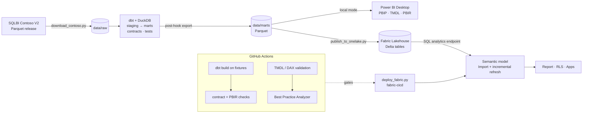
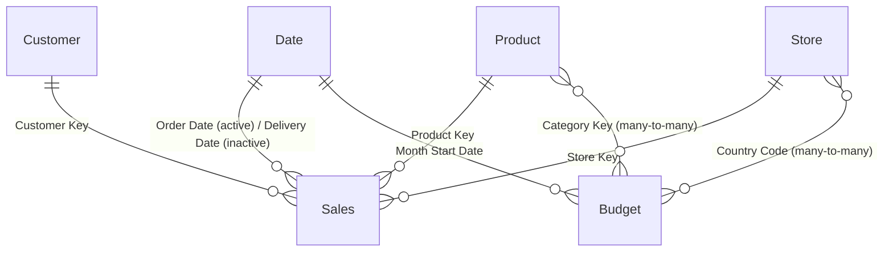

# Contoso Retail Analytics: end-to-end Power BI

An end-to-end retail analytics product. It turns raw order data into a governed Power BI semantic model and executive report, with the practices a production BI team uses: a tested transformation layer, model-as-code, automated quality gates and CI/CD to Microsoft Fabric.

[](https://github.com/leon2378/powerbi-contoso-retail-analytics/actions/workflows/ci.yml)


*Executive Overview on the 100K-order dataset (2016–2025). Sales vs budget compares the same months on both sides; YoY % comes from the Time Intelligence calculation group.*

| Layer | What's here |
|---|---|
| **Ingest** | SQLBI's Contoso V2 dataset (100K to 10M orders) downloaded as Parquet, plus a synthetic fixture generator for CI |
| **Transform** | dbt + DuckDB: staging views → star-schema marts with **enforced contracts**, data tests, **unit tests** and a source-reconciliation test |
| **Semantic model** | Power BI project (PBIP) in **TMDL**: import mode with **incremental refresh**, **calculation group** for time intelligence, **field parameter**, **dynamic RLS**, budget at a coarser grain via many-to-many relationships, dynamic format strings |
| **Report** | **PBIR** (enhanced report format) with a custom, colour-blind-safe theme and a starter Executive Overview page |
| **Quality gates** | TMDL validation with the Tabular Object Model, DAX reference checks, **Best Practice Analyzer**, dbt ↔ model contract check, PBIR schema + field-reference checks, generated data dictionary |
| **Deploy** | Delta tables to a **Fabric Lakehouse**, model + report via **fabric-cicd**, GitHub Actions with OIDC (no secrets) and DEV → TEST → PROD promotion with approvals |

## Architecture



The semantic model has **one** data-access function, `fnLoadTable`. `scripts/set_model_source.py` switches its body between local Parquet files and the Fabric Lakehouse, so the same model runs on a laptop with no cloud account and in production. It is not an `if/else` inside M: the Power BI service would then demand a gateway for the unused file source.

## Quick start (local, no cloud needed)

Prerequisites: Python 3.11+, [Power BI Desktop](https://aka.ms/pbidesktopstore) (enable *Options → Preview features → Store reports using enhanced metadata format (PBIR)*), and optionally the .NET 8 SDK for the TMDL validator.

```powershell
.\tasks.ps1 setup            # .venv + dependencies
.\tasks.ps1 all -Size 1m     # download ~66 MB, dbt build + tests, point the model at data\marts
```

Then open `powerbi\ContosoRetail.pbip` in Power BI Desktop and click **Refresh**. Before committing, run `.\tasks.ps1 model-reset` so your local path is not committed (CI warns if it is).

Other tasks: `.\tasks.ps1 check` (everything CI runs), `docs` (dbt lineage site), `dictionary`, `deploy`. Run `.\tasks.ps1 help` for the full list.

## Repository layout

```
├── scripts/                  ingest, publish, deploy and validation scripts (Python)
├── transform/                dbt project
│   ├── models/staging/       1:1 with source files: rename, cast, minimise PII
│   ├── models/marts/         star schema + contracts, unit tests (exported to Parquet)
│   ├── seeds/                budget growth targets, RLS entitlements
│   └── tests/                singular tests (source ↔ mart reconciliation)
├── powerbi/
│   ├── ContosoRetail.pbip
│   ├── ContosoRetail.SemanticModel/definition/   TMDL: tables, measures, roles, relationships
│   └── ContosoRetail.Report/definition/          PBIR: pages and visuals as JSON
├── ci/
│   ├── TmdlValidator/        .NET tool: TOM deserialisation + DAX reference checks
│   └── bpa-rules.json        Best Practice Analyzer rules (severity 3 fails CI)
├── docs/                     data dictionary (generated), deployment and report-design guides
└── .github/workflows/        ci.yml (quality gates), deploy.yml (Fabric CD)
```

## The model



Key design decisions:

- **Grain-aware budget.** The budget exists per month × category × store country. `[Budget Amount]` checks the filter context and returns BLANK below that grain (a single day, a product, a customer segment), instead of silently showing a wrong number.
- **One calculation group instead of 100 measures.** `Time Intelligence` provides Current, MTD, QTD, YTD, PY, PY YTD, YoY, YoY % and Rolling 12M for every measure. Prior-year items only compare dates that have sales, so a partial year is compared like for like. YoY % is suppressed for ratio measures, where it would be misleading.
- **Dynamic RLS.** `Regional Manager` filters stores (and, through the relationship, the budget) by the signed-in user's entitlements. `Global Viewer` is the unrestricted role. Entitlements are data (a dbt seed), not hard-coded DAX.
- **Import + incremental refresh**, not Direct Lake. Up to about 10M orders, Import keeps full DAX and calculated-column flexibility, runs offline and demonstrates partition management. At 100M+ rows, switch the partitions to Direct Lake on the same Lakehouse tables.
- **Descriptions live next to the code.** Every measure has a `///` description (enforced by BPA), which feeds the field-list tooltips, Copilot and the generated [data dictionary](docs/data-dictionary.md).

## Quality gates

| Check | Catches | Runs in |
|---|---|---|
| `dbt build` (fixtures) | broken SQL, contract/type drift, failed data tests, unit-test regressions, source ↔ mart totals mismatch | CI, `tasks.ps1 check` |
| `check_model_contract.py` | a dbt column renamed or retyped without updating the Power BI model | CI, `check` |
| `TmdlValidator` | TMDL syntax, broken object references, relationship type mismatches, DAX references to missing columns or measures | CI, `check` |
| Best Practice Analyzer | missing descriptions or format strings, visible FKs, `/` instead of `DIVIDE`, floating point, bi-directional relationships, … | CI (Tabular Editor 2) |
| `validate_report.py` | PBIR files that violate Microsoft's JSON schemas, invalid theme, visuals bound to fields that no longer exist, formatting values Power BI would silently ignore | CI, `check` |
| `generate_data_dictionary.py --check` | documentation drifting from the model | CI, `check` |
| Source-mode guard | the model committed in Fabric mode or with a machine-specific path | CI |

## Deploying to Microsoft Fabric

`main` deploys to DEV automatically. TEST and PROD are promoted manually, and PROD needs an approval. The pipeline builds the marts, publishes them as Delta tables, deploys the model and report with fabric-cicd, binds the data connection and runs an enhanced refresh. One-time setup (workspaces, service principal with OIDC, connection, GitHub environments) is in **[docs/deployment.md](docs/deployment.md)**.

## Building out the report

The Executive Overview page is a starting point. **[docs/report-design.md](docs/report-design.md)** has the page plan (sales, customers and cohorts, products, stores, budget variance, drill-through), the colour system and the accessibility and performance checklists.

## Roadmap

- Direct Lake variant for the 100M-order dataset.
- Budget write-back with Power BI translytical task flows (Fabric User Data Functions).
- Usage and refresh monitoring (Fabric workspace monitoring) with alerts.
- Publish dbt docs to GitHub Pages from CI.

## Credits

Data: [Contoso Data Generator V2](https://github.com/sql-bi/Contoso-Data-Generator-V2) by SQLBI (synthetic data). See that repository for its licence terms. The budget and RLS entitlements are synthetic and generated in this project.
