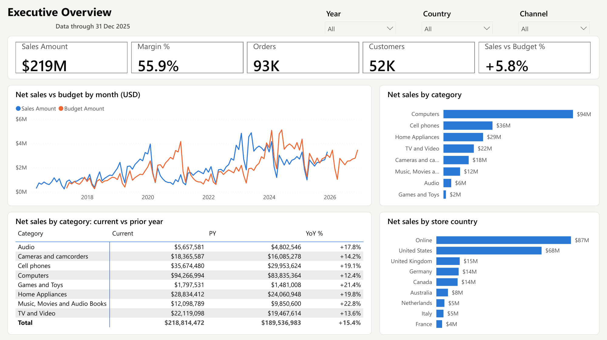
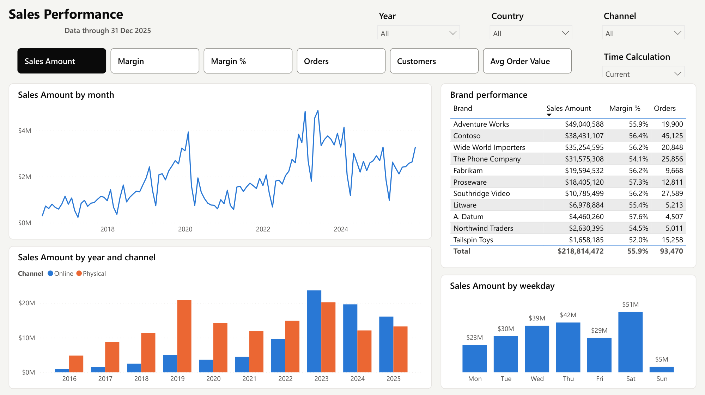
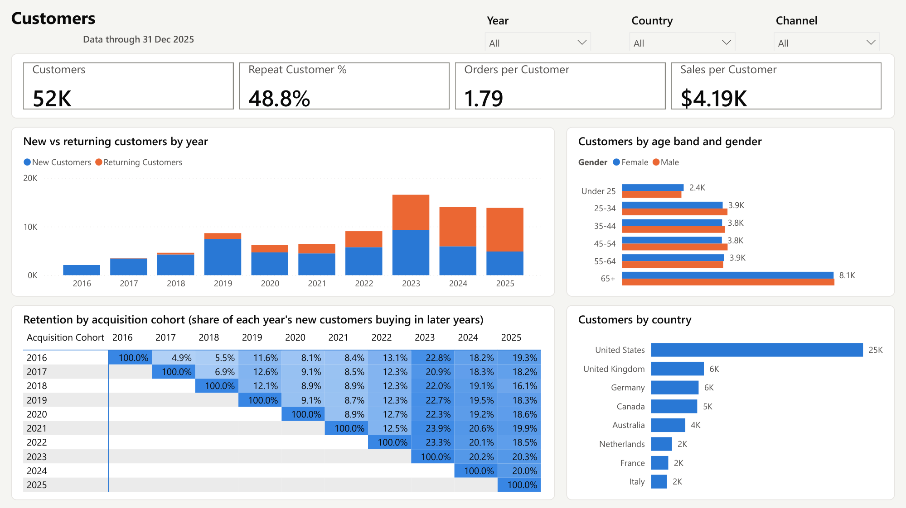
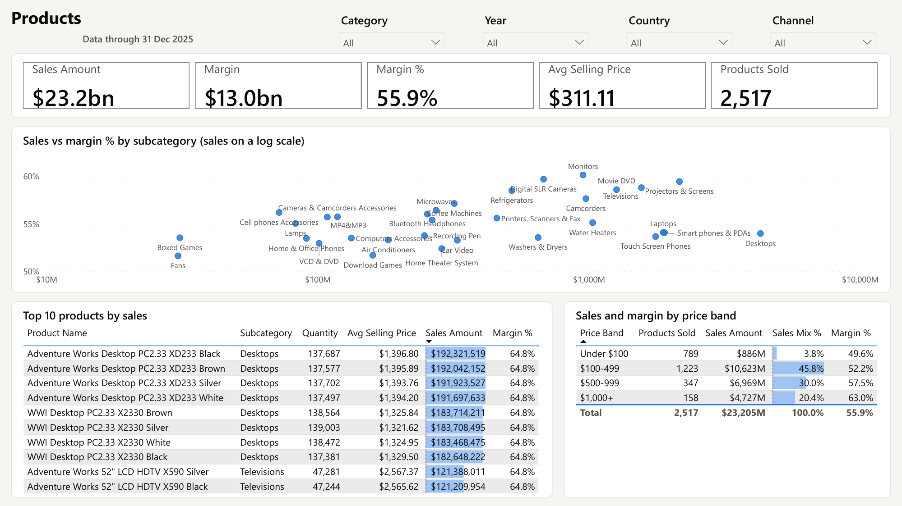
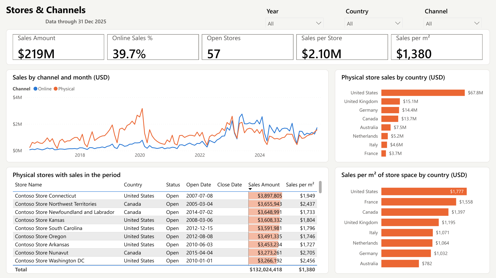
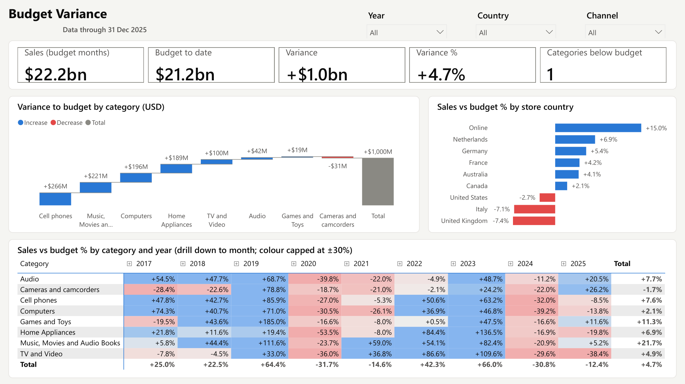
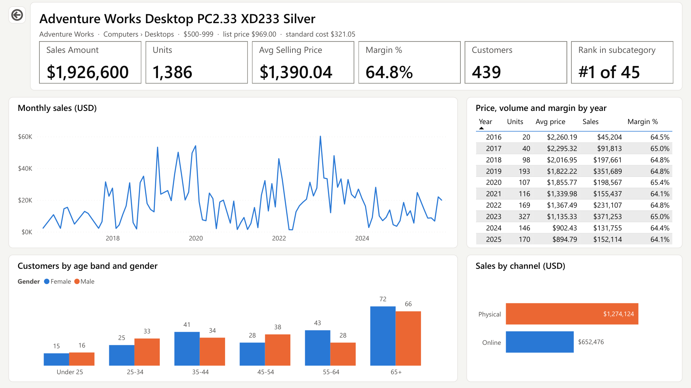
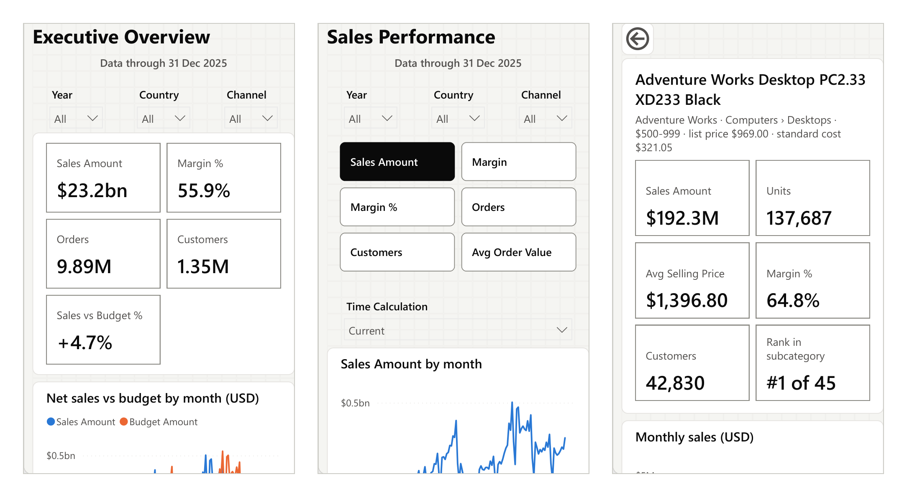
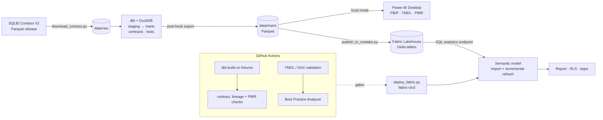
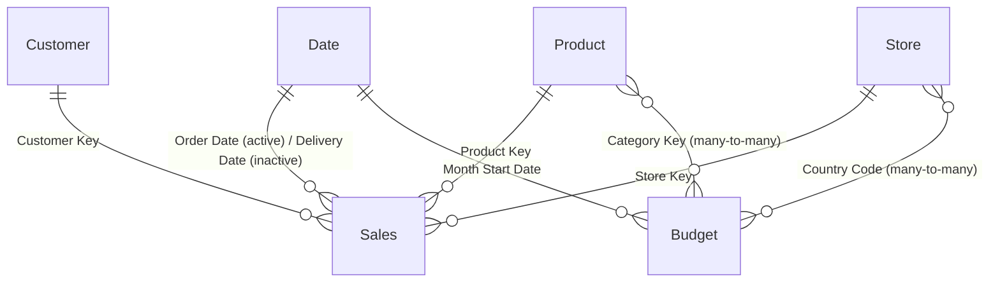

# Contoso Retail Analytics: end-to-end Power BI

An end-to-end retail analytics product. It turns raw order data into a governed Power BI semantic model and a six-page report, plus a product drill-through and a hover tooltip page, using the practices a production BI team relies on: a tested transformation layer, model-as-code, automated quality gates and CI/CD to Microsoft Fabric.

[](https://github.com/leon2378/powerbi-contoso-retail-analytics/actions/workflows/ci.yml)



*Executive Overview on the 10M-order dataset (23.7M order lines, 2016–2025). Sales vs budget compares the same months on both sides; YoY % comes from the Time Intelligence calculation group.*

| Layer | What's here |
|---|---|
| **Ingest** | SQLBI's Contoso V2 dataset (100K to 10M orders) downloaded as Parquet, plus a synthetic fixture generator for CI |
| **Transform** | dbt + DuckDB: staging views → star-schema marts with **enforced contracts**, data tests, **unit tests** and a source-reconciliation test |
| **Semantic model** | Power BI project (PBIP) in **TMDL**: import mode with **incremental refresh**, a **calculation group** for time intelligence, a **field parameter**, **dynamic RLS**, a budget at a coarser grain via many-to-many relationships, cohort retention measures and dynamic format strings |
| **Report** | Six **PBIR** pages (enhanced report format) with a colour-blind-safe theme, alt text on every visual (live values for KPI cards), phone layouts for every page and the drill-through, slicers synced across pages, field-parameter metric tiles, titles that follow the selection, a cohort retention heatmap, a top-N product table, store productivity (sales per m²), a budget variance waterfall and heatmap, a product drill-through page and a category tooltip page |
| **Quality gates** | TMDL validation with the Tabular Object Model, DAX reference checks, **Best Practice Analyzer**, dbt ↔ model contract check, lineage-tag check, PBIR schema and field-reference checks, accessibility checks (alt text, tab order), generated data dictionary |
| **Deploy** | Delta tables to a **Fabric Lakehouse**, model and report via **fabric-cicd**, GitHub Actions with OIDC (no secrets) and DEV → TEST → PROD promotion with approvals |

## Report pages

The six main pages share one header: Year, Country and Channel slicers that stay in sync as you move between pages, and a "Data through …" freshness label. Legend colours are pinned to each value (Online and Female are always blue), so filtering never repaints them.

- **Executive Overview.** How are we doing against last year and the budget? KPI cards (Sales Amount, Margin %, Orders, Customers, Sales vs Budget %), net sales vs budget by month, sales by category and store country, and a category matrix with Current, PY and YoY %.
- **Sales Performance.** What drives revenue? Metric tiles (a field parameter) switch every chart between Sales Amount, Margin, Margin %, Orders, Customers and Avg Order Value. The Time Calculation dropdown (the calculation group) applies YTD, PY, YoY %, Rolling 12M and more. Charts show the monthly trend, online vs physical by year, a weekday profile and brand performance, and every title names what's on display, e.g. "Orders (YoY %) by month".
- **Customers.** Are we acquiring and keeping customers? KPI cards (Customers, Repeat Customer %, Orders per Customer, Sales per Customer), new vs returning customers by year, customers by age band and gender and by country, and a cohort retention heatmap.
- **Products.** What sells, at what price and margin? KPI cards (Sales Amount, Margin, Margin %, Avg Selling Price, Products Sold), sales vs margin % for each of the 32 subcategories (sales on a log scale), the top 10 products by sales and a price band summary showing each band's share of sales and margin. A Category slicer in the header narrows every visual, e.g. to see how one category's sales split across price bands.
- **Stores & Channels.** Where do we sell? KPI cards (Sales Amount, Online Sales %, Open Stores, Sales per Store, Sales per m²), online vs physical sales by month (online overtook physical stores in 2023), physical store sales by country with drill-down to state, a table of physical stores with their open and close dates, and sales per m² of store space by country. Physical-store visuals are orange, matching the Physical colour on every page. To test row-level security, use *Modeling → View as* with the Regional Manager role and a user from `rls_user_access.csv` (e.g. `emea.manager@contoso.example`).
- **Budget Variance.** Where are we off plan? KPI cards (sales and budget over the same months, variance, variance % and how many categories are below budget), a waterfall of the variance by category, variance % by store country and a category × year heatmap that drills down to months. Blue is above budget and red below (the theme's diverging pair), and every value carries a + or − sign, so colour never carries the meaning alone.
- **Product Detail** (drill-through). Right-click any product, e.g. in the Products page's top 10, and choose *Drill through → Product Detail*. The header names the product with its brand, category, price band, list price and cost, then shows sales, units, average selling price, margin %, customers and its rank in its subcategory, plus a monthly trend, price, volume and margin by year, customers by age band and gender, and sales by channel. Filters from the source page carry over, and the back button returns to it (in Power BI Desktop, Ctrl+click buttons: a plain click only selects them for editing). Browsed directly, the page opens on the top seller.
- **Category tooltip** (report-page tooltip). Hover a category bar on the Executive Overview, a step of the Budget Variance waterfall or a subcategory in the Products scatter to see its sales, margin, monthly trend and price-band mix.





*The heatmap shows what share of each year's new customers bought again in later years. About half of each cohort buys again in any later year. The colour scale runs from 25% to 70%, so the differences between cohorts stay visible next to the 100% diagonal.*



*Margin rises with price: products under $100 earn 49.6%, products at $1,000 and above earn 63.0%. The $100–499 band brings in 45.8% of sales.*



*Online overtook physical stores in 2023 and took 61% of sales in 2024. Over the ten years, US stores sold $191,365 per m², more than twice Australia's $79,766.*



*Over 2017–2025 sales beat budget by $1.0bn (+4.7%), and the online store beat it by $1.16bn (+15.0%) on its own: physical stores came in $0.16bn under plan, led by the US and the UK. 2020 and 2024 missed plan in every category: each budget is the prior year plus a growth target, so a strong year sets a high bar for the next.*



*Product Detail for the top seller. Its average selling price fell from $2,275 in 2016 to $912 in 2025 while the margin held at about 65%.*



*The first screen of three phone layouts. Every page and the drill-through has one: KPI cards in two columns, then the charts, with the wide tables and heatmaps left for the desktop view.*

## Architecture



The semantic model has **one** data-access function, `fnLoadTable`. `scripts/set_model_source.py` switches its body between local Parquet files and the Fabric Lakehouse, so the same model runs on a laptop with no cloud account and in production. It is not an `if/else` inside M, because the Power BI service would then demand a gateway for the unused file source.

## Quick start (local, no cloud needed)

Prerequisites: Python 3.11+, [Power BI Desktop](https://aka.ms/pbidesktopstore) (a recent version; if your version lists them under *Options → Preview features*, enable the Power BI Project, TMDL and PBIR options), and optionally the .NET 8 SDK for the TMDL validator and PerfKit.

```powershell
.\tasks.ps1 setup            # .venv + dependencies
.\tasks.ps1 all -Size 10m    # download ~680 MB, dbt build + tests, point the model at data\marts
```

Then open `powerbi\ContosoRetail.pbip` in Power BI Desktop, click **Refresh** (about 5 minutes for 23.7M order lines) and save. The data isn't in the repository: Desktop keeps it in `.pbi/cache.abf` (git-ignored) when you save, and opens from it next time, so without a save every session starts with a refresh. The screenshots use this 10M release; `-Size 100k` or `-Size 1m` is quicker for trying things out. See [Performance at 10M orders](#performance-at-10m-orders) for what that scale takes.

- **After changing model files outside Desktop** (editing TMDL, or pulling someone else's changes), close Power BI Desktop completely and open the `.pbip` again. Reopening the file inside a running Desktop session can leave new measures out of the visuals.
- **Before committing**, run `.\tasks.ps1 model-reset` so your local data path isn't committed (CI warns if it is), then `.\tasks.ps1 model-local` to keep working in Desktop. A save in Desktop also rewrites the report and model files in its own format (newer schema versions, reordered properties), so check `git status` for changes you didn't make.

Other tasks: `.\tasks.ps1 check` (everything CI runs), `docs` (dbt lineage site), `dictionary`, `deploy`. Run `.\tasks.ps1 help` for the full list.

## Repository layout

```
├── tasks.ps1                 task runner: setup, data, build, check, model-local/reset, deploy
├── scripts/                  ingest, publish, deploy and validation scripts (Python)
├── transform/                dbt project
│   ├── models/staging/       1:1 with source files: rename, cast, minimise PII
│   ├── models/marts/         star schema + contracts, unit tests (exported to Parquet)
│   ├── seeds/                budget growth targets, RLS entitlements
│   └── tests/                singular tests (source ↔ mart reconciliation, order-grain assumptions)
├── powerbi/
│   ├── ContosoRetail.pbip
│   ├── ContosoRetail.SemanticModel/definition/   TMDL: tables, measures, roles, relationships
│   └── ContosoRetail.Report/definition/          PBIR: pages and visuals as JSON
├── ci/
│   ├── TmdlValidator/        .NET tool: TOM deserialisation + DAX reference checks
│   └── bpa-rules.json        Best Practice Analyzer rules (severity 3 fails CI)
├── tools/PerfKit/            .NET tool: trace, replay, size and refresh the model running in Desktop
├── docs/                     data dictionary (generated), deployment, report-design and performance guides, screenshots
└── .github/workflows/        ci.yml (quality gates), deploy.yml (Fabric CD)
```

## The model



Key design decisions:

- **Grain-aware budget.** The budget exists per month × category × store country. `[Budget Amount]` checks the filter context and returns BLANK below that grain (a single day, a product, a customer segment) instead of silently showing a wrong number. Budget variance compares only months that have both actuals and a budget.
- **One calculation group instead of 100 measures.** `Time Intelligence` provides Current, MTD, QTD, YTD, PY, PY YTD, YoY, YoY % and Rolling 12M for every measure. Prior-year items only compare dates that have sales, so a partial year is compared like for like. YoY % is suppressed for ratio measures, where it would be misleading, and text measures (labels, titles) pass through unchanged.
- **Cohort retention.** `[Cohort Retention %]` divides the customers active in a period by the size of their acquisition cohort, counted over the cohort's whole first year regardless of the date filter. With Acquisition Cohort on rows and Year on columns, it forms the retention triangle.
- **Dynamic RLS.** `Regional Manager` filters stores (and, through the relationship, the budget) by the signed-in user's entitlements. `Global Viewer` is the unrestricted role. Entitlements are data (a dbt seed), not hard-coded DAX.
- **Import + incremental refresh**, not Direct Lake. Up to about 10M orders, Import keeps full DAX and calculated-column flexibility, runs offline and demonstrates partition management. At 100M+ rows, switch the partitions to Direct Lake on the same Lakehouse tables.
- **Descriptions live next to the code.** Every measure has a `///` description (enforced by BPA), which feeds the field-list tooltips, Copilot and the generated [data dictionary](docs/data-dictionary.md).

## Quality gates

| Check | Catches | Runs in |
|---|---|---|
| `dbt build` (fixtures) | broken SQL, contract/type drift, failed data tests, unit-test regressions, source ↔ mart totals mismatch, broken order-grain assumptions behind the fast `[Orders]` measure | CI, `tasks.ps1 check` |
| `check_model_contract.py` | a dbt column renamed or retyped without updating the Power BI model | CI, `check` |
| `add_lineage_tags.py --check` | hand-written model objects without a `lineageTag`, which Desktop silently drops from visuals | CI, `check` |
| `TmdlValidator` | TMDL syntax, broken object references, relationship type mismatches, DAX references to missing columns or measures | CI, `check` |
| Best Practice Analyzer | missing descriptions or format strings, visible FKs, `/` instead of `DIVIDE`, floating point, bi-directional relationships, … | CI (Tabular Editor 2) |
| `validate_report.py` | PBIR files that violate Microsoft's JSON schemas, an invalid theme, visuals bound to fields that no longer exist, formatting values Power BI would silently ignore (visual, container and phone-layout settings, e.g. a tooltip type), visuals without alt text, tab order that doesn't follow the layout | CI, `check` |
| `generate_data_dictionary.py --check` | documentation drifting from the model | CI, `check` |
| Source-mode guard | the model committed in Fabric mode or with a machine-specific path | CI |

The [report design guide](docs/report-design.md) has the page plan, colour system and checklists, and the [lessons](docs/report-design.md#working-with-the-project-outside-desktop) from building the report by editing TMDL and PBIR directly.

## Performance at 10M orders

The screenshots above come from SQLBI's 10M-order release (23.7M order lines, 1.7M customers), and this is what that scale takes. Details, method and how to reproduce are in **[docs/performance.md](docs/performance.md)**.

- `dbt build` (11 models, 2 seeds, 45 tests): **27 s**. Full refresh in Power BI Desktop: **4 min 13 s**. Model size in memory: **845 MB**.
- Every query the report sends was recorded during a click-through and replayed on a cleared cache: **93% run under 1 s cold** (up from 76%), the 90th percentile dropped from 3.7 s to **0.83 s**, and warm queries take 6 ms (median).
- The gains came from counting orders by their first line where no product filter applies (a dbt test guards the assumption), a cheaper repeat-customer count, and Units instead of Orders in the brand table. The six queries still above 1 s cold count distinct customers among 1.7M.
- The run also caught a check that only failed at scale: sub-cent rounding across 23.7M lines broke the source ↔ mart reconciliation test's $1 tolerance. It now rounds like the mart and requires an exact match.

## Deploying to Microsoft Fabric

`main` deploys to DEV automatically. TEST and PROD are promoted manually, and PROD needs an approval. The pipeline builds the marts, publishes them as Delta tables, deploys the model and report with fabric-cicd, binds the data connection and runs an enhanced refresh. One-time setup (workspaces, service principal with OIDC, connection, GitHub environments) is in **[docs/deployment.md](docs/deployment.md)**.

Status: the deployable build (the model switched to the Fabric source) is produced and validated in every CI run, but it has not been deployed to a live tenant yet. That needs a Fabric capacity (a trial works) and the one-time setup; until the `FABRIC_ENABLED` variable is set, the deploy workflow skips itself. For a first deploy from your own machine, `FABRIC_AUTH=browser` signs in through the browser, so the Azure CLI isn't needed.

## Roadmap

- A first live deployment to Fabric (the pipeline is built and validated in CI; see the status above).
- Direct Lake variant for the 100M-order dataset.
- Budget write-back with Power BI translytical task flows (Fabric User Data Functions).
- Usage and refresh monitoring (Fabric workspace monitoring) with alerts.
- Publish dbt docs to GitHub Pages from CI.

## Credits

Data: [Contoso Data Generator V2](https://github.com/sql-bi/Contoso-Data-Generator-V2) by SQLBI (synthetic data). See that repository for its licence terms. The budget and RLS entitlements are synthetic and generated in this project.
